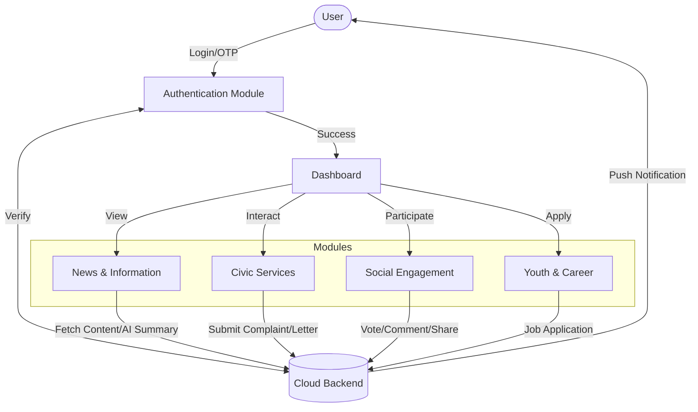
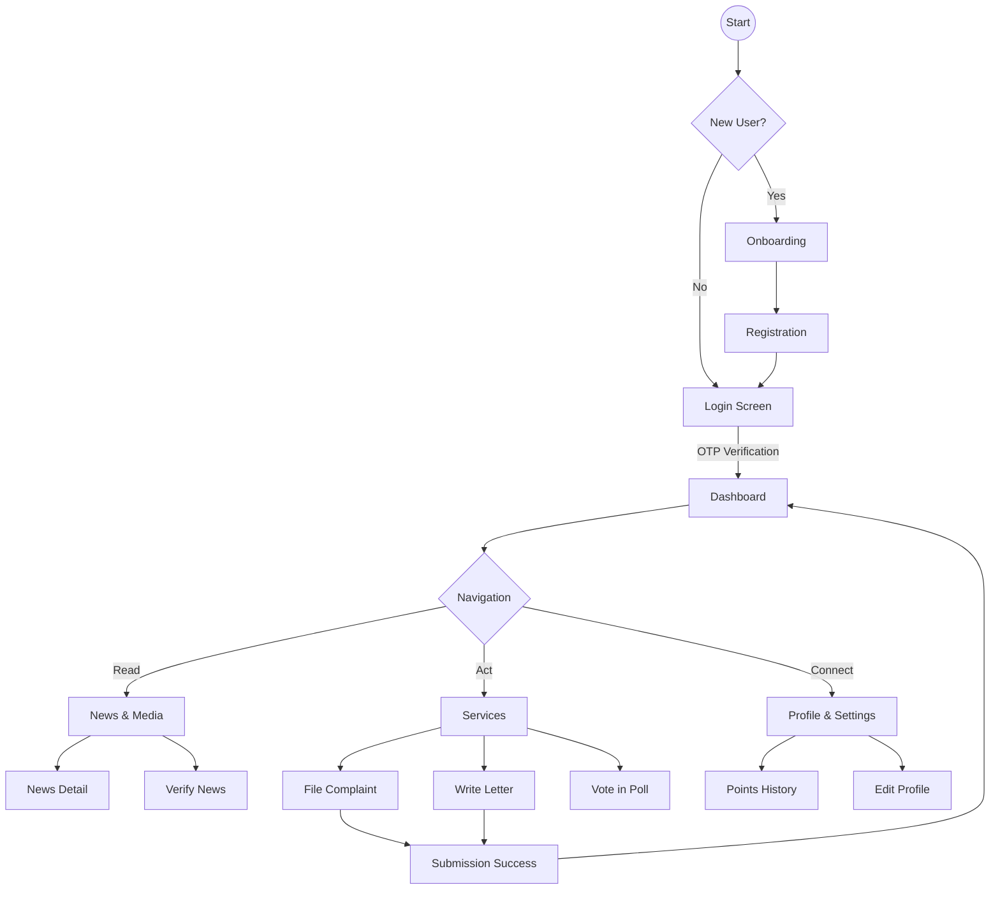

# Voice of Daimary: A Comprehensive Digital Framework for Civic Engagement and Community Empowerment

**Date:** December 16, 2025  
**Type:** Technical Research Paper  

---

## Abstract

In the rapidly evolving landscape of digital governance, the gap between citizens and administrative bodies remains a critical challenge. This paper introduces **Voice of Daimary**, a holistic mobile application designed to bridge this divide through a multi-faceted digital ecosystem. Voice of Daimary integrates civic services, social engagement, youth empowerment, and gamified community participation into a unified platform. This document specifies the architectural design, operational modules, user workflows, and the diverse benefits of the system, illustrating how technology can drive transparent and efficient community building.

---

## 1. Introduction

### 1.1 Purpose
The primary purpose of Voice of Daimary is to serve as a digital bridge between the community and its leadership/administration. It moves beyond simple "complaint logging" to fostering active participation through polls, idea submissions, and direct communication channels like "Samvad" (Dialogue).

### 1.2 Problem Statement
Traditional methods of civic engagement are often fragmented, opaque, and slow. Citizens lack a centralized platform to:
1.  Access government schemes and services.
2.  Voice local concerns effectively.
3.  Participate in decision-making.
4.  Find local employment or professional opportunities.

### 1.3 Solution
Voice of Daimary addresses these issues by providing a robust, Flutter-based cross-platform application that categorizes user needs into four pillars: **Service**, **Information**, **Opportunity**, and **Engagement**.

---

## 2. System Architecture

The application is built using a modern technology stack ensuring scalability, performance, and a premium user experience.

*   **Frontend**: Flutter (Dart) for cross-platform native performance.
*   **State Management**: Riverpod for reactive and testable state handling.
*   **Routing**: GoRouter for deep linking and seamless navigation.
*   **UI/UX**: Custom design system with glassmorphism, dark/light modes, and responsive layouts.

### 2.1 Data Flow Diagram (DFD)

The following diagram illustrates the high-level flow of data within the Voice of Daimary ecosystem.

---

## 3. Detailed Module Description

Voice of Daimary is composed of several specialized modules, each targeting a specific aspect of community life.

### 3.1 Civic Services Module
*   **Complaints**: A transparent system for logging issues (e.g., sanitation, roads). Users can track status from 'Pending' to 'Resolved'.
*   **Letter to MLA**: A direct digital correspondence feature allowing users to draft and send official letters to their representatives.
*   **Booth Info**: Provides localized electoral data, helping users know their polling stations and officers.
*   **Senior Schemes**: A dedicated section for the elderly to access relevant government welfare schemes.

### 3.2 Information & News Module
*   **Hyper-Local News**: Curated news stories relevant to the community, supporting rich media (video/images).
*   **Fake News Check**: An AI-powered tool where users can submit dubious URLs to verify their authenticity, combating misinformation.
*   **Podcasts & Reels**: Short-form and long-form content to engage younger audiences with community updates.

### 3.3 Social Engagement Module
*   **Polls**: A democratic tool for gathering public opinion on local issues in real-time.
*   **Samvad (Dialogue)**: An event management system for town halls and public meetings.
*   **Ideas**: A crowdsourcing platform where citizens can submit innovative ideas for community improvement.
*   **AI Chat**: An intelligent assistant to help users navigate the app and find information instantly.

### 3.4 Youth & Career Module
*   **Jobs & Internships**: A local job portal connecting youth with employers.
*   **Professionals Directory**: A listing of local experts (Doctors, Lawyers, etc.) to foster a local service economy.

### 3.5 Gamification & Environment
*   **Green Challenges**: Encourages eco-friendly habits (e.g., planting trees) by awarding points.
*   **Leaderboard**: A ranking system based on user engagement and contributions, incentivizing active citizenship.
*   **Points & History**: Tracks the user's "Karma" or contribution score.

---

## 4. Application Flowchart

This flowchart details the typical user navigation path through the application.

---

## 5. User Journey

**Persona:** *Rahul, a 24-year-old student and active community member.*

1.  **Discovery**: Rahul opens Voice of Daimary to check local news. He sees a "Featured" story about a new park renovation.
2.  **Engagement**: He notices a **Poll** regarding the park's design. He votes for "Option B" and sees live results.
3.  **Action**: Walking to college, he spots uncollected garbage. He opens the **Complaints** module, snaps a photo, and submits it. He instantly receives a ticket ID.
4.  **Value**: Later, he checks the **Jobs** section for part-time internships and finds a local opening.
5.  **Reward**: For his activity (Voting, Reporting), he earns **Green Points**, moving him up the **Leaderboard**, giving him a sense of contribution and recognition.

---

## 6. Purpose and Benefits

### 6.1 For the Citizen
*   **Empowerment**: Direct line to administration and influence on decision-making.
*   **Convenience**: Access to all services (Jobs, Schemes, Complaints) in one app.
*   **Recognition**: Gamified rewards for good citizenship.

### 6.2 For the Administration
*   **Data-Driven Insights**: Polls and analytics provide real-time feedback on public sentiment.
*   **Efficiency**: Digital complaint tracking reduces paperwork and response time.
*   **Transparency**: Builds trust by making processes visible and accountable.

### 6.3 For the Community
*   **Economic Growth**: Connecting local professionals and job seekers.
*   **Social Cohesion**: Events (Samvad) and Birthday greetings foster a tighter-knit community.
*   **Sustainability**: Green challenges promote environmental responsibility.

---

## 7. Conclusion

Voice of Daimary is more than just a mobile application; it is a digital infrastructure for a modern, responsive, and engaged society. By integrating diverse functionalities—from grievance redressal to career opportunities—into a seamless, user-centric experience, Voice of Daimary sets a new benchmark for GovTech and community apps. It transforms passive residents into active citizens, fostering a cycle of transparency, trust, and collective growth.

---
*Generated for Voice of Daimary Development Team*
